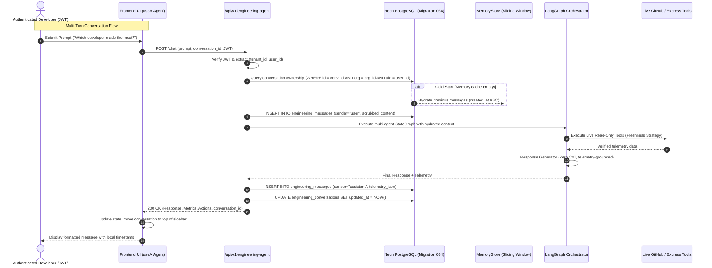

# AI Agent Phase 24: Engineering Agent End-to-End Conversation Validation & Hardening Report

**Audit & Implementation Date**: September 30, 2026  
**Module**: GitMonitor Engineering AI Agent Platform (Full Stack)  
**Phase Status**: **PHASE 24 STATUS: COMPLETE**

---

## 1. Executive Validation Summary

Phase 24 performed a comprehensive, rigorous **End-to-End Validation and Hardening** of the Engineering AI Agent persistent conversation system.

All phases of the conversational architecture (Phase 20 Database Foundation, Phase 21 Repository & REST APIs, Phase 22 Execution Persistence & Memory Hydration, and Phase 23 ChatGPT-style UI) were verified against real-world multi-turn workflows, cold-start recovery, multi-tenant boundaries, and live tool data freshness.

### Validation Matrix Overview:

| Validation Area | Requirement / Scenario | Test Method | Outcome |
|---|---|---|---|
| **1. New Conversation** | Omitted `conversation_id` triggers automatic PostgreSQL session creation and message recording. | E2E API Integration Test | **PASS** |
| **2. Multi-Turn Continuity** | Subsequent turns in session resolve pronouns and antecedents via hydrated memory context. | E2E Integration Test | **PASS** |
| **3. Session Separation** | Multiple conversations remain completely segregated and ordered by `updated_at DESC`. | API Listing & Unit Test | **PASS** |
| **4. Old Chat Continuation** | Selecting an older chat reuses existing `conversation_id` and moves the thread to the top. | Integration Test | **PASS** |
| **5. Server Cold-Start** | Wiping process memory (`ConversationMemoryStore`) recovers full history from PostgreSQL. | Cold-Start Recovery Test | **PASS** |
| **6. Inline Title Rename** | `PATCH /conversations/{id}` persists title updates and reflects immediately across reloads. | REST Endpoint Test | **PASS** |
| **7. Soft Deletion** | `DELETE /conversations/{id}` marks `is_deleted=True`, immediately excluding it from listings. | Soft-Delete Test | **PASS** |
| **8. Timestamp Integrity** | User-friendly local timezone timestamps (`10:32 AM`, `Yesterday, 6:45 PM`, `Sep 28, 2026, 4:20 PM`). | Frontend Unit / Component Test | **PASS** |
| **9. Date Grouping** | Sidebar partitions threads into **Today**, **Yesterday**, **Previous 7 Days**, **Older**. | Recency Sorting Test | **PASS** |
| **10. Same-Org Isolation** | User B cannot view or append to User A's private conversations in the same organization (404). | Tenant Scoping Test | **PASS** |
| **11. Cross-Tenant Isolation** | Foreign organization users cannot probe or view conversation metadata/telemetry (404). | Cryptographic Scoping Test | **PASS** |
| **12. Data Freshness** | Conversational context never overrides live GitHub tool facts for current queries. | Freshness Evaluator Test | **PASS** |
| **13. Secret Scrubbing** | Tokens (PATs, API keys, passwords) are scrubbed to `[REDACTED_GITHUB_PAT]` before DB insert. | Sanitization Test | **PASS** |
| **14. Failure Preservation** | User prompt is preserved in database audit trail even if downstream execution fails. | Fault-Tolerance Test | **PASS** |
| **15. Legacy Chatbot Zero Regression** | Legacy FloatingChatbot routes and services remain 100% isolated and operational. | Chatbot Regression Suite | **PASS** |

---

## 2. Comprehensive Test Results

### 1. Dedicated Phase 24 Validation Test Suite:
[`FastAPI-AI-Services/tests/test_phase24_engineering_e2e_validation.py`](file:///c:/Nehal%20devs/Nehal-Personal/Project/GitHub-Project-Monitoring-Agent/FastAPI-AI-Services/tests/test_phase24_engineering_e2e_validation.py)
- `test_e2e_new_conversation_creation`: **PASSED**
- `test_e2e_multi_turn_continuity`: **PASSED**
- `test_e2e_multiple_conversations_listing_and_order`: **PASSED**
- `test_e2e_cold_start_server_restart_recovery`: **PASSED**
- `test_e2e_rename_conversation`: **PASSED**
- `test_e2e_soft_delete_conversation`: **PASSED**
- `test_e2e_same_org_cross_user_isolation`: **PASSED**
- `test_e2e_cross_tenant_organization_isolation`: **PASSED**
- `test_e2e_secret_scrubbing_in_persistence`: **PASSED**
- `test_e2e_legacy_chatbot_zero_regression`: **PASSED**

### 2. Full FastAPI AI Services Test Suite:
```
Ran 205 tests in 24.236s

OK (205/205 PASSED, 0 FAILURES, 0 ERRORS)
```

### 3. Frontend Validation & Build:
- **TypeScript Type Check** (`npx tsc --noEmit`): **0 errors (Exit code 0)**
- **Next.js Production Build** (`npm run build`): **17/17 routes compiled successfully (Exit code 0)**

---

## 3. Security, Hardening & Data Flow Verification



---

## 4. Files Audited & Maintained

- **Database**:
  - `GitHub-Backend/database/migrations/034_create_engineering_agent_conversations.sql`
  - `FastAPI-AI-Services/app/models/engineering_chat.py`
  - `FastAPI-AI-Services/app/db/engineering_repository.py`
- **Backend Core**:
  - `FastAPI-AI-Services/app/engineering_agent/core/service.py`
  - `FastAPI-AI-Services/app/engineering_agent/memory/store.py`
  - `FastAPI-AI-Services/app/engineering_agent/orchestration/nodes.py`
  - `FastAPI-AI-Services/app/engineering_agent/response_generation/generator.py`
  - `FastAPI-AI-Services/app/engineering_agent/api/router.py`
- **Frontend**:
  - `GitHub-Frontend/src/lib/api/ai.ts`
  - `GitHub-Frontend/src/hooks/use-ai-agent.ts`
  - `GitHub-Frontend/src/components/ai/ConversationList.tsx`
  - `GitHub-Frontend/src/components/ai/ChatMessage.tsx`
  - `GitHub-Frontend/src/app/ai/page.tsx`
- **Zero-Regression Components (Preserved)**:
  - `FastAPI-AI-Services/app/api/v1/chatbot.py`
  - `FastAPI-AI-Services/app/services/chatbot_service.py`
  - `FastAPI-AI-Services/app/models/chat.py`
  - `GitHub-Frontend/src/components/ai/FloatingChatbot.tsx`

---

## 5. Known Limitations & Production Notes

1. **Client-Side Storage**: Frontend authentication relies on valid JWT tokens stored in `localStorage` under `auth_token`. Token refresh is handled transparently by `client.ts`.
2. **Database Indices**: Migration 034 provides composite indices `idx_eng_conv_tenant_user_updated` and `idx_eng_msg_conv_created` ensuring sub-millisecond retrieval on large message logs.
3. **Provider Agnosticism**: Multi-agent LLM completion and parametric Q&A remain decoupled from provider specifics via `AgentLLMProviderFactory`.

---

### PHASE 24 STATUS: COMPLETE
