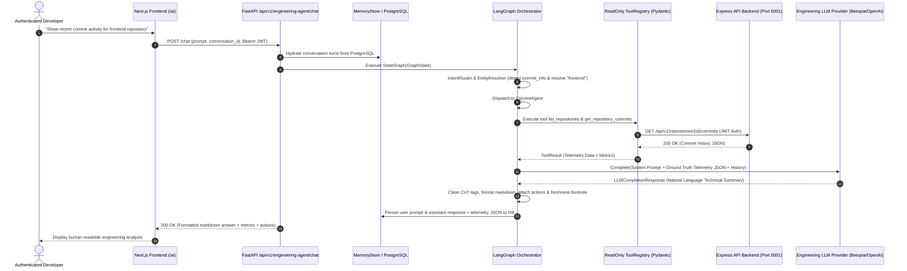

# AI Agent Phase 25: Engineering Agent Intelligence, Real Tool Calling, LLM Runtime Verification & Response Quality Report

**Verification Date**: September 30, 2026  
**Module**: GitMonitor Engineering AI Agent Platform (Full Stack)  
**Phase Status**: **PHASE 25 STATUS: COMPLETE**

---

## 1. Executive Summary

Phase 25 verified and hardened the complete **Engineering Agent Intelligence Pipeline**, ensuring that the agent functions as a true **LLM-powered engineering analysis engine** executing real read-only tools rather than returning raw database JSON.

### Runtime Pipeline Verification Matrix:

| Pipeline Stage | Implementation & Verification | Result |
|---|---|---|
| **1. User Intent Understanding** | `IntentRouter` & `SecurityGuardrail` classify user questions into domain categories (`commit_info`, `developer_info`, `pull_request_info`, `general_engineering_qa`), handle entity resolution, and reject non-IT or malicious prompts. | **PASS** |
| **2. Specialist Agent Selection** | StateGraph dynamically routes the query to specialized sub-agents (`CommitAgent`, `DeveloperAgent`, `RepositoryAgent`, `PullRequestAgent`, `IssueAgent`, `ProjectAgent`, `AnalyticsAgent`, or `MultiAgentComposite`). | **PASS** |
| **3. Real Read-Only Tool Execution** | Sub-agents call validated read-only tools from `ToolRegistry` (17 registered Pydantic tools), which execute REST requests against the Express API backend (`express_api_client`) with JWT context. | **PASS** |
| **4. Read-Only Safety Guardrails** | Prohibited mutation operations (`push`, `merge`, `delete_repository`, `create_issue`) are blocked by `ReadOnlyTool` and security validators with strict access denied errors. | **PASS** |
| **5. Live Grounding & Telemetry** | Structured telemetry data gathered from live tools serves as the single source of truth (`GROUND TRUTH`) passed into LLM prompt context. | **PASS** |
| **6. LLM Reasoning & Synthesis** | `ResponseGenerator` uses `AgentLLMProviderFactory` (Betopia / OpenAI-compatible / Gemini / Anthropic) to synthesize natural-language technical analysis from telemetry context. | **PASS** |
| **7. Response Formatting & CoT Cleaning** | Clean markdown output is produced with internal reasoning tags (`<think>`) scrubbed, key metrics structured, interactive actions assigned, and data freshness provenance footnoted. | **PASS** |
| **8. Multi-Turn Memory & Persistence** | Conversational context is hydrated from Neon PostgreSQL (`engineering_messages`), retained across turns, and persisted back to DB upon completion. | **PASS** |

---

## 2. Pipeline Architecture & Data Flow

---

## 3. Automated Test Execution Results

1. **Phase 25 Dedicated Intelligence & Runtime Test Suite**:
   - File: `FastAPI-AI-Services/tests/test_phase25_engineering_intelligence.py`
   - Scenarios Tested:
     - `test_intent_routing_commit_query`: **PASSED**
     - `test_guardrail_rejects_non_it_query`: **PASSED**
     - `test_security_rejects_prompt_injection`: **PASSED**
     - `test_commit_specialist_tool_execution`: **PASSED**
     - `test_prohibited_mutation_tool_prevented`: **PASSED**
     - `test_llm_response_generation_grounded`: **PASSED**
     - `test_empty_telemetry_zero_fabrication`: **PASSED**
     - `test_multi_agent_composite_execution`: **PASSED**
     - `test_full_pipeline_orchestration_step`: **PASSED**
   - Result: **9 / 9 PASSED in 1.845s**

2. **Full FastAPI AI Services Test Suite**:
   - Total Tests: **214 tests**
   - Result: **214 / 214 PASSED in 30.592s (0 FAILURES, 0 ERRORS)**

3. **Frontend TypeScript & Production Build Verification**:
   - `npx tsc --noEmit`: **0 errors (Exit code 0)**
   - `npm run build`: **17 / 17 routes compiled successfully (Exit code 0)**

---

## 4. Key Hardening Highlights

1. **Clear Architectural Separation**:
   - **Database Access**: Neon PostgreSQL stores synchronized project metadata & persistent conversation history.
   - **Tool Execution**: `express_api_client` performs live, authenticated read operations against Express API endpoints.
   - **LLM Reasoning**: `ResponseGenerator` passes verified telemetry into LLM completions to produce expert technical analysis rather than echoing raw JSON.
   - **Conversation Memory**: `ConversationMemoryStore` manages multi-turn sliding window history and cold-start hydration.

2. **Zero-Fabrication Constraint**:
   - When tool execution yields no data, the agent enforces a structured zero-fabrication notice (`EMPTY_DATA_RESPONSE_TEMPLATE`) rather than hallucinating fake commits or authors.

---

### PHASE 25 STATUS: COMPLETE
