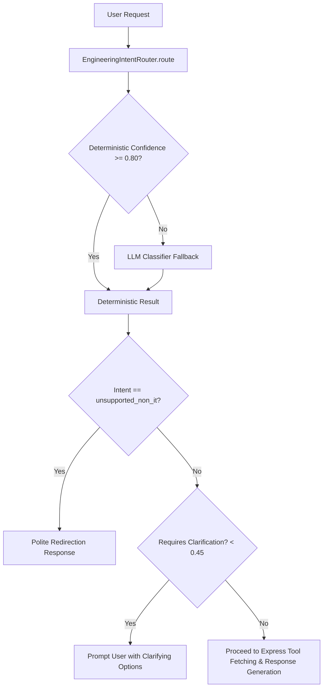

# Phase 3: Engineering Agent Intent Router Report

## 1. Executive Summary

Phase 3 introduces an intelligent, hybrid Intent Router to the **Engineering Agent** inside `FastAPI-AI-Services`. Before selecting tools or specialist sub-agents, the Engineering Agent classifies the incoming user request to understand its domain, target entities (repositories, developers, project metrics, timeframes), and level of confidence.

### Core Objectives Achieved:
1. **11 Classification Categories**: Precise classification spanning repository metadata, commits, developer velocity, pull requests, issue tracking, code impact/churn, project overview, single/cross-repository analytics, general software engineering Q&A, and non-IT out-of-domain requests.
2. **Hybrid Deterministic + LLM Routing**: Ultra-fast deterministic regex/keyword heuristics (sub-millisecond latency, zero LLM token cost) with seamless LLM-based fallback for ambiguous or conversational queries.
3. **Typo & Variation Resilience**: Robust normalization dictionary handling spelling mistakes (e.g., `comits`, `devloper`, `repositry`, `pullrequst`, `anlytics`), name variations (`masfiqur did`, `alex's PRs`), and conversational natural language patterns (`"show me nexora commits"` -> repository commit query).
4. **Confidence Handling & Clarification**: Calculates numerical confidence ($0.0 \le c \le 1.0$). When confidence is below threshold ($< 0.45$), the agent asks clarifying questions with suggested options instead of making unsafe assumptions.
5. **Non-IT Guardrail**: Non-IT and unsupported requests are gracefully identified and redirected without invoking unnecessary backend tooling or leaking internal prompts.
6. **Zero Chain-of-Thought Exposure**: Strict reasoning isolation; raw internal thoughts and classification telemetry remain in backend logs and metadata, never in user-facing responses.
7. **Zero Regression Guarantee**: Existing Chatbot (`/api/v1/chatbot/*`), Express backend, and Next.js frontend remain 100% untouched and functional.

---

## 2. Intent Classification Categories

| Enum Value | Category Name | Description | Example Queries |
| :--- | :--- | :--- | :--- |
| `repository_info` | Repository Information | Metadata, branches, repo status, languages | *"List all repositories", "What is the status of repo X?"* |
| `commit_info` | Commit Information | Commit history, latest revisions, messages | *"Show me nexora commits", "Latest commits on main branch"* |
| `developer_info` | Developer Information | Contributor activity, velocity, individual commits | *"How many commits did masfiqur do last week?", "Alex's PRs"* |
| `pull_request_info`| Pull Request Information| PR lists, reviews, review turnaround times | *"Open pull requests in nexora", "PR turnaround time"* |
| `issue_info` | Issue Information | Bug tracking, ticket resolution, open issues | *"Show me closed issues", "Bugs logged this month"* |
| `code_impact` | Code Impact & Churn | Lines added/deleted, churn metrics, file impact| *"Code impact of latest release", "Lines added and deleted"* |
| `project_info` | Project Overview | High-level project metadata and scope | *"Tell me about project Apollo", "Project details"* |
| `dashboard_analytics`| Dashboard Analytics | Overall workspace health, KPI summary | *"Executive dashboard metrics", "Tenant analytics overview"*|
| `cross_repository_analytics`| Cross-Repo Analytics | Benchmarking, comparisons across repositories | *"Compare nexora vs hospital-frontend", "Cross repo churn"* |
| `general_engineering_qa`| General Engineering Q&A| Architectural, syntax, git concepts | *"Difference between git merge and git rebase"* |
| `unsupported_non_it` | Unsupported / Non-IT | Out-of-scope non-engineering requests | *"How to cook Italian pizza at home"* |

---

## 3. Router Architecture & File Structure

```
FastAPI-AI-Services/app/engineering_agent/
├── router/
│   ├── __init__.py                  # Router exports
│   ├── schemas.py                   # IntentCategory enum, ExtractedEntities, IntentClassificationResult
│   ├── deterministic_matcher.py     # Typo normalization, entity extraction, regex rule heuristics
│   ├── llm_classifier.py            # LLM-based disambiguation using abstract provider
│   └── intent_router.py             # Master EngineeringIntentRouter (hybrid orchestration)
├── agents/
│   └── orchestrator.py              # EngineeringAgentOrchestrator integrating IntentRouter
└── api/
    └── v1/
        └── engineering_agent.py     # POST /api/v1/engineering-agent/chat
```

### Module Responsibilities:

1. **[schemas.py](file:///c:/Nehal%20devs/Nehal-Personal/Project/GitHub-Project-Monitoring-Agent/FastAPI-AI-Services/app/engineering_agent/router/schemas.py)**:
   - `IntentCategory`: 11-intent enumeration.
   - `ExtractedEntities`: Holds `repository_name`, `developer_name`, `project_name`, `timeframe`, and `metric_targets`.
   - `IntentClassificationResult`: Encapsulates `intent`, `confidence`, `entities`, `requires_clarification`, `suggested_options`, `source` (`"deterministic"` vs `"llm"`), and `execution_time_ms`.

2. **[deterministic_matcher.py](file:///c:/Nehal%20devs/Nehal-Personal/Project/GitHub-Project-Monitoring-Agent/FastAPI-AI-Services/app/engineering_agent/router/deterministic_matcher.py)**:
   - Performs rule-based typo replacement using regex boundary substitutions.
   - Standardizes timeframes: `"last week"` $\to$ `"7d"`, `"last month"` $\to$ `"30d"`, `"yesterday"` $\to$ `"1d"`.
   - Extracts candidate entity names while pruning grammatical stopwords.
   - Scores match confidence between $0.85$ and $0.95$.

3. **[llm_classifier.py](file:///c:/Nehal%20devs/Nehal-Personal/Project/GitHub-Project-Monitoring-Agent/FastAPI-AI-Services/app/engineering_agent/router/llm_classifier.py)**:
   - Triggered when deterministic confidence $< 0.80$ or when explicit disambiguation is required.
   - Uses the Phase 2 provider abstraction (`agent_llm_factory.get_provider()`).
   - Prompts the model with strict JSON formatting to classify intent, extract entities, and score confidence.

4. **[intent_router.py](file:///c:/Nehal%20devs/Nehal-Personal/Project/GitHub-Project-Monitoring-Agent/FastAPI-AI-Services/app/engineering_agent/router/intent_router.py)**:
   - Coordinates deterministic matching and LLM fallback.
   - Attaches context-aware clarification suggestions if confidence $< 0.45$.

---

## 4. End-to-End Orchestrator Integration

In [orchestrator.py](file:///c:/Nehal%20devs/Nehal-Personal/Project/GitHub-Project-Monitoring-Agent/FastAPI-AI-Services/app/engineering_agent/agents/orchestrator.py), the execution flow proceeds as follows:



---

## 5. Verification & Test Suite Results

Comprehensive automated test suites were executed across all layers.

### Phase 3 Test Suite (`tests/test_phase3_intent_router.py`):
```
Ran 15 tests in 1.290s
OK
```
1. `test_intent_repository_info` — Verified "list all repositories in this organization" $\to$ `repository_info` (0.88).
2. `test_intent_commit_info` — Verified "show me nexora commits" $\to$ `commit_info` (0.85).
3. `test_intent_developer_info` — Verified "how many commit masfiqur did last week" $\to$ `developer_info` (0.92, dev: `masfiqur`, timeframe: `7d`).
4. `test_intent_pull_request_info` — Verified "show open PRs and pull requests" $\to$ `pull_request_info` (0.89).
5. `test_intent_issue_info` — Verified "show me bug tickets and unresolved issues" $\to$ `issue_info` (0.89).
6. `test_intent_code_impact` — Verified "what is the code impact and churn for latest release" $\to$ `code_impact` (0.88).
7. `test_intent_project_info` — Verified "give me an overview of project Apollo" $\to$ `project_info` (0.88).
8. `test_intent_dashboard_analytics` — Verified "show dashboard analytics and overall metrics" $\to$ `dashboard_analytics` (0.88).
9. `test_intent_cross_repository_analytics` — Verified "compare nexora vs hospital-management-frontend" $\to$ `cross_repository_analytics` (0.90).
10. `test_intent_general_engineering_qa` — Verified "what is the difference between git merge and git rebase" $\to$ `general_engineering_qa` (0.85).
11. `test_unsupported_non_it_rejection` — Verified "how to cook Italian pizza at home" $\to$ `unsupported_non_it` (0.95).
12. `test_typo_resilience` — Verified "comits by devloper alex in repositry" $\to$ `developer_info` (dev: `alex`).
13. `test_router_async_execution` — Verified async routing returns clean structured schema.
14. `test_endpoint_unsupported_non_it_guardrail` — Verified HTTP 200 polite redirect without invoking internal tools.
15. `test_endpoint_developer_info_intent` — Verified HTTP 200 successful execution on developer queries.

### Regression Test Suite Verification:
- **Phase 1 Test Suite (`test_phase1_engineering_agent.py`)**: 7/7 Tests Passed (OK).
- **Phase 2 Test Suite (`test_phase2_llm_provider.py`)**: 11/11 Tests Passed (OK).
- **Backend TypeScript Compilation (`GitHub-Backend`)**: `npx tsc --noEmit` exited with code 0 (0 errors).
- **Frontend TypeScript Compilation (`GitHub-Frontend`)**: `npx tsc --noEmit` exited with code 0 (0 errors).
- **Existing Chatbot Service**: Untouched, active, and fully operational.
