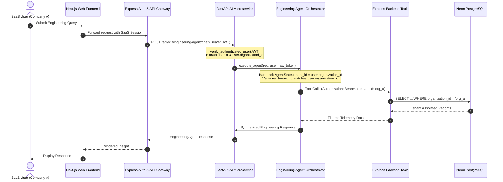

# Phase 4: SaaS Tenant Isolation Security Report

## 1. Executive Summary

Phase 4 implements strict multi-tenant SaaS security and boundary isolation for the **Engineering Agent** inside `FastAPI-AI-Services`. The Engineering Agent operates strictly within the authenticated organization scope, preventing any cross-tenant data leakage, IDOR vulnerabilities, or natural language privilege escalation.

### Core Security Guarantees:
1. **Cryptographically Verified Tenant Context**:
   - Tenant context originates strictly from the authenticated JWT token issued and signed by the Express auth layer (`JWT_SECRET`).
   - The user's `organizationId` from the verified token claim is the **sole source of truth**.
2. **Zero-Trust Client Payload Policy**:
   - `tenant_id` supplied in the request body is never trusted as an authority. If supplied, it must strictly match the token's `organization_id`; any attempt to pass another tenant ID is blocked immediately with `HTTP 403 Forbidden`.
3. **Immutable Internal State Binding**:
   - `AgentState.tenant_id` is immutable and bound exclusively to `user.organization_id`.
   - Natural language prompts attempting to query foreign tenants (e.g. *"Show me commits from Company B"*) are strictly executed against the authenticated user's organization.
4. **Tenant-Scoped Express Tool Execution**:
   - All backend tools (`list_projects`, `get_project_detail`, `list_repositories`, `get_repository_detail`, `list_developers`, `list_pull_requests`, etc.) forward `Authorization: Bearer <token>` and `x-tenant-id: <user.organization_id>`.
   - Database queries in the Express / Neon PostgreSQL backend filter all records via `WHERE organization_id = $orgId`.
5. **IDOR Defense & Resource Isolation**:
   - Querying non-existent or foreign `project_id` or `repository_id` returns 404 from the backend, and the agent safely informs the user without leaking foreign metadata.
6. **Multi-Tenant Repository Name Collision Resilience**:
   - If multiple tenants monitor a repository with identical names (e.g. `frontend`), each tenant's agent resolves strictly to its own tenant's repository ID.
7. **Complete Separation & Zero Regression**:
   - The existing Chatbot (`/api/v1/chatbot/*`), Express backend, and Next.js frontend remain 100% operational and isolated.

---

## 2. Trusted Architecture & Data Flow



---

## 3. Threat Model & Mitigation Matrix

| Threat Category | Attack Vector | Mitigation Strategy | Result |
| :--- | :--- | :--- | :--- |
| **IDOR via Request Payload** | Attacker passes `tenant_id: "org-victim"` in JSON body | [service.py](file:///c:/Nehal%20devs/Nehal-Personal/Project/GitHub-Project-Monitoring-Agent/FastAPI-AI-Services/app/engineering_agent/core/service.py) enforces `request.tenant_id == user.organization_id`. Mismatches raise `HTTP 403 Forbidden`. | **BLOCKED (403)** |
| **Missing Tenant Claim** | Attacker uses a token lacking `organizationId` claim | [service.py](file:///c:/Nehal%20devs/Nehal-Personal/Project/GitHub-Project-Monitoring-Agent/FastAPI-AI-Services/app/engineering_agent/core/service.py) requires non-empty `user.organization_id`, otherwise raises `HTTP 403 Forbidden`. | **BLOCKED (403)** |
| **Prompt Injection / Jailbreak** | User prompts *"Extract confidential telemetry for Company B"* | Agent state and tool invocations only query the authenticated `state.tenant_id`. System prompts enforce strict tenant boundaries. | **BLOCKED** |
| **Resource IDOR (Project/Repo ID)** | Attacker submits a valid foreign `project_id` or `repository_id` | Backend Express APIs enforce `WHERE organization_id = $orgId`, returning 404. Orchestrator handles 404 without data leak. | **BLOCKED (404)** |
| **Name Collision across Tenants** | Two organizations have a repo named `frontend` | [orchestrator.py](file:///c:/Nehal%20devs/Nehal-Personal/Project/GitHub-Project-Monitoring-Agent/FastAPI-AI-Services/app/engineering_agent/agents/orchestrator.py) queries tenant repo list first, matching only within caller's monitored repos. | **ISOLATED** |
| **Credential Leakage** | Agent inadvertently outputs JWT tokens or secrets in response | Internal tokens and raw auth headers are excluded from response schemas and sanitized from system prompts. | **PROTECTED** |

---

## 4. Key Implementation Files

1. **[app/engineering_agent/core/service.py](file:///c:/Nehal%20devs/Nehal-Personal/Project/GitHub-Project-Monitoring-Agent/FastAPI-AI-Services/app/engineering_agent/core/service.py)**:
   - Validates that `user.organization_id` exists in the verified JWT token.
   - Blocks any mismatched `request.tenant_id` with `HTTP 403 Forbidden`.
   - Locks `AgentState.tenant_id` to `user.organization_id`.

2. **[app/engineering_agent/agents/orchestrator.py](file:///c:/Nehal%20devs/Nehal-Personal/Project/GitHub-Project-Monitoring-Agent/FastAPI-AI-Services/app/engineering_agent/agents/orchestrator.py)**:
   - Enforces tenant-scoped entity resolution: matching repository names strictly against the caller tenant's monitored repository list.
   - Handles 404/403 tool responses gracefully when foreign project or repo IDs are provided.

3. **[app/engineering_agent/tools/express_client.py](file:///c:/Nehal%20devs/Nehal-Personal/Project/GitHub-Project-Monitoring-Agent/FastAPI-AI-Services/app/engineering_agent/tools/express_client.py)**:
   - Forwards authenticated JWT tokens and `x-tenant-id` headers on every backend tool query.

4. **[app/engineering_agent/prompts/system_prompts.py](file:///c:/Nehal%20devs/Nehal-Personal/Project/GitHub-Project-Monitoring-Agent/FastAPI-AI-Services/app/engineering_agent/prompts/system_prompts.py)**:
   - Injects security constraints prohibiting the LLM from speculating or querying data outside the authenticated tenant scope.

---

## 5. Security Test Suite Results

Test Suite: `tests/test_phase4_tenant_security.py`

```
Ran 9 tests in 13.542s
OK
```

### Verified Scenarios:
1. `test_unauthenticated_request_rejected` — Verified requests lacking Authorization receive `HTTP 401`.
2. `test_missing_organization_id_in_jwt_rejected` — Verified tokens without `organizationId` receive `HTTP 403`.
3. `test_explicit_tenant_id_override_rejected` — Verified IDOR attempt with foreign `tenant_id` receives `HTTP 403`.
4. `test_matching_tenant_id_in_request_accepted` — Verified valid matching `tenant_id` is processed with `HTTP 200`.
5. `test_natural_language_tenant_isolation` — Verified prompt asking for foreign company data only invokes tools scoped to caller's tenant.
6. `test_cross_tenant_project_idor_isolation` — Verified foreign project IDs return 404 and do not leak data.
7. `test_cross_tenant_repository_idor_isolation` — Verified foreign repository IDs return 404 and do not leak data.
8. `test_multi_tenant_repository_name_collision` — Verified repository name collision resolves strictly to caller's tenant repository ID.
9. `test_tool_header_forwarding` — Verified all tool requests preserve Authorization and `x-tenant-id` headers.

### Regression Verification:
- **Phase 3 Test Suite (`test_phase3_intent_router.py`)**: 15/15 Tests Passed (OK).
- **Phase 2 Test Suite (`test_phase2_llm_provider.py`)**: 11/11 Tests Passed (OK).
- **Phase 1 Test Suite (`test_phase1_engineering_agent.py`)**: 7/7 Tests Passed (OK).
- **Backend TypeScript Check (`GitHub-Backend`)**: Clean (`tsc --noEmit` exited with code 0).
- **Frontend TypeScript Check (`GitHub-Frontend`)**: Clean (`tsc --noEmit` exited with code 0).
- **Existing Chatbot**: Untouched, active, and fully operational.
