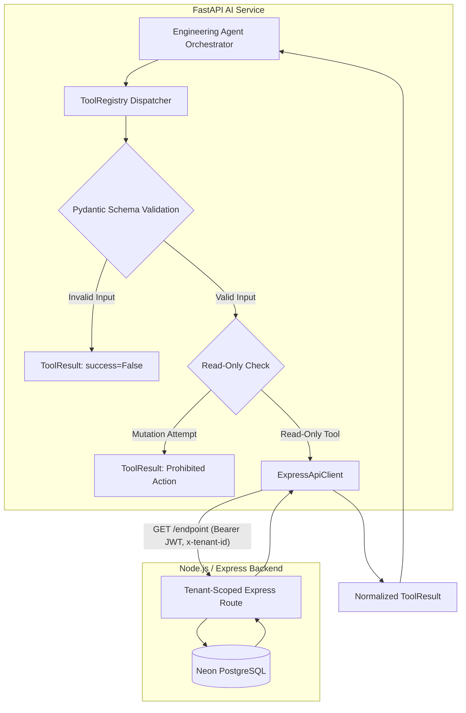

# Phase 5: Engineering Agent Tool Layer Report

## 1. Executive Summary

Phase 5 establishes a secure, modular, strictly **READ-ONLY** Tool Layer for the **Engineering Agent** inside `FastAPI-AI-Services`. The Engineering Agent does not directly manage or store GitHub private keys; instead, it utilizes the existing Express backend and GitHub App synchronization infrastructure as the authoritative data access layer.

### Core Guarantees & Capabilities:
1. **17 Safe Read-Only Tools**: Complete coverage spanning repositories, branches, commits, pull requests, issues, developer velocity, code impact/churn, project statistics, and dashboard telemetry.
2. **Authoritative Access via Express/GitHub Layer**: The Engineering Agent never holds GitHub private keys, installation tokens, or OAuth client secrets directly. It communicates through the authenticated Express REST API.
3. **Strict Mutation Prohibition**:
   - Zero mutation endpoints.
   - Absolutely prohibited: `push`, `commit`, `branch creation`, `branch deletion`, `PR merge`, `issue modification`, `repository deletion/modification`, and `GitHub permission modification`.
   - Tool instantiation blocks prohibited mutation operations at registration time.
4. **Pydantic Input Validation**: Every tool has a dedicated Pydantic input model validating required fields, string lengths, integer ranges, and optional query filters.
5. **Tenant Context Preservation**: Every tool invocation forwards `Authorization: Bearer <token>` and `x-tenant-id: <user.organization_id>`.
6. **Graceful Error & Empty Result Handling**:
   - Empty lists/null data return `success=True` with empty collections (`[]`).
   - 404/403 errors from backend are returned cleanly as structured `ToolResult` objects without crashing the agent.
7. **JSON Schema Export for LLM Tool Calling**: `tool_registry.get_tool_definitions()` exports standard OpenAPI/JSON Schemas for multi-agent function calling.
8. **Zero Regressions**: Existing Chatbot, Express backend, and Next.js frontend remain completely intact.

---

## 2. Tool Layer Catalog (17 Read-Only Tools)

| # | Tool Name | Input Model | Target Backend Endpoint | Description |
|---|---|---|---|---|
| 1 | `get_repository` | `GetRepositoryInput` | `GET /repositories/:id` | Fetch repository metadata, sync status, default branch, languages |
| 2 | `list_repositories` | `ListRepositoriesInput` | `GET /repositories` | Fetch all monitored repositories within the tenant |
| 3 | `get_repository_branches`| `GetRepositoryBranchesInput`| `GET /repositories/:id` | Fetch branches and default branch |
| 4 | `get_repository_commits` | `GetRepositoryCommitsInput` | `GET /repositories/:id/commits`| Fetch commit history with author info and pagination |
| 5 | `get_commit_details` | `GetCommitDetailsInput` | `GET /commits/:id/changes` | Fetch deep commit details, message, stats, and file diffs |
| 6 | `get_repository_pull_requests`| `GetRepositoryPullRequestsInput`| `GET /repositories/:id/pull-requests`| Fetch pull requests with optional status filtering |
| 7 | `get_pull_request_details`| `GetPullRequestDetailsInput`| `GET /pull-requests/:id` | Fetch PR reviews, turnaround time, additions/deletions |
| 8 | `get_repository_issues` | `GetRepositoryIssuesInput` | `GET /repositories/:id/issues` | Fetch repository issues with open/closed filtering |
| 9 | `get_issue_details` | `GetIssueDetailsInput` | `GET /issues/:id` | Fetch issue lifecycle details, labels, and resolution state |
| 10 | `get_repository_developers`| `GetRepositoryDevelopersInput`| `GET /developers` | Fetch contributors and developer rankings |
| 11 | `get_developer_activity` | `GetDeveloperActivityInput` | `GET /developers/:id/activity` | Fetch real-time activity stream and event timeline |
| 12 | `get_developer_commit_statistics`| `GetDeveloperCommitStatisticsInput`| `GET /developers/:id/analytics` | Fetch throughput, commit distribution, and code churn |
| 13 | `get_code_impact` | `GetCodeImpactInput` | `GET /repositories/:id/churn` | Fetch code churn, additions, deletions, and high impact files |
| 14 | `get_project` | `GetProjectInput` | `GET /projects/:id` | Fetch project metadata and scope |
| 15 | `get_project_repositories`| `GetProjectRepositoriesInput`| `GET /projects/:id/repositories`| Fetch all repositories linked to a project |
| 16 | `get_project_statistics` | `GetProjectStatisticsInput` | `GET /reports/project/:id` | Fetch aggregated KPI benchmarks, commit totals, developer counts |
| 17 | `get_dashboard_analytics`| `GetDashboardAnalyticsInput`| `GET /dashboard/overview` | Fetch workspace overview telemetry and overall health |

---

## 3. Architecture & Data Flow



---

## 4. Key Implementation Files

1. **[app/engineering_agent/tools/schemas.py](file:///c:/Nehal%20devs/Nehal-Personal/Project/GitHub-Project-Monitoring-Agent/FastAPI-AI-Services/app/engineering_agent/tools/schemas.py)**:
   - Pydantic input models for all 17 read-only tools.
   - Standardized `ToolResult` and `ToolDefinition` dataclasses.

2. **[app/engineering_agent/tools/registry.py](file:///c:/Nehal%20devs/Nehal-Personal/Project/GitHub-Project-Monitoring-Agent/FastAPI-AI-Services/app/engineering_agent/tools/registry.py)**:
   - `ReadOnlyTool` wrapper and `ToolRegistry` dispatcher.
   - Built-in `PROHIBITED_MUTATION_OPERATIONS` blocklist.
   - Input validation, execution duration tracking, and JSON schema export.

3. **[app/engineering_agent/tools/express_client.py](file:///c:/Nehal%20devs/Nehal-Personal/Project/GitHub-Project-Monitoring-Agent/FastAPI-AI-Services/app/engineering_agent/tools/express_client.py)**:
   - Read-only HTTP client forwarding JWT authorization and `x-tenant-id` headers.

4. **[app/engineering_agent/tools/__init__.py](file:///c:/Nehal%20devs/Nehal-Personal/Project/GitHub-Project-Monitoring-Agent/FastAPI-AI-Services/app/engineering_agent/tools/__init__.py)**:
   - Unified module exports.

---

## 5. Automated Verification & Test Results

Test Suite: `tests/test_phase5_tool_layer.py`

```
Ran 23 tests in 0.031s
OK
```

### Verified Test Cases:
1. `test_registry_contains_all_17_tools` — Verified all 17 tools are registered with `is_read_only=True`.
2. `test_prohibited_mutation_actions_rejected` — Verified write actions (`push`, `commit`, `merge`, `branch delete`) are rejected.
3. `test_tool_instantiation_blocks_mutation_names` — Verified `ReadOnlyTool` raises `ValueError` on write tool names.
4. `test_input_validation_failure_handled_gracefully` — Verified missing required fields return clean `ToolResult.error`.
5. `test_tool_get_repository` — Verified `get_repository` tool execution.
6. `test_tool_list_repositories` — Verified `list_repositories` tool execution.
7. `test_tool_get_repository_branches` — Verified `get_repository_branches` tool execution.
8. `test_tool_get_repository_commits` — Verified `get_repository_commits` tool execution.
9. `test_tool_get_commit_details` — Verified `get_commit_details` tool execution.
10. `test_tool_get_repository_pull_requests` — Verified `get_repository_pull_requests` tool execution.
11. `test_tool_get_pull_request_details` — Verified `get_pull_request_details` tool execution.
12. `test_tool_get_repository_issues` — Verified `get_repository_issues` tool execution.
13. `test_tool_get_issue_details` — Verified `get_issue_details` tool execution.
14. `test_tool_get_repository_developers` — Verified `get_repository_developers` tool execution.
15. `test_tool_get_developer_activity` — Verified `get_developer_activity` tool execution.
16. `test_tool_get_developer_commit_statistics` — Verified `get_developer_commit_statistics` tool execution.
17. `test_tool_get_code_impact` — Verified `get_code_impact` tool execution.
18. `test_tool_get_project` — Verified `get_project` tool execution.
19. `test_tool_get_project_repositories` — Verified `get_project_repositories` tool execution.
20. `test_tool_get_project_statistics` — Verified `get_project_statistics` tool execution.
21. `test_tool_get_dashboard_analytics` — Verified `get_dashboard_analytics` tool execution.
22. `test_empty_results_handled_gracefully` — Verified `None` data returns `success=True` and `data=[]`.
23. `test_tool_schema_export` — Verified valid JSON schemas for all 17 tools for LLM agent integration.

### Regression Verification:
- **Phase 4 Tenant Security Test Suite (`test_phase4_tenant_security.py`)**: 9/9 Tests Passed (OK).
- **Phase 3 Intent Router Test Suite (`test_phase3_intent_router.py`)**: 15/15 Tests Passed (OK).
- **Phase 2 LLM Provider Test Suite (`test_phase2_llm_provider.py`)**: 11/11 Tests Passed (OK).
- **Phase 1 Engineering Agent Test Suite (`test_phase1_engineering_agent.py`)**: 7/7 Tests Passed (OK).
- **Backend TypeScript Compilation (`GitHub-Backend`)**: `npx tsc --noEmit` exited with code 0.
- **Frontend TypeScript Compilation (`GitHub-Frontend`)**: `npx tsc --noEmit` exited with code 0.
- **Chatbot Service**: Untouched, active, and fully operational.
