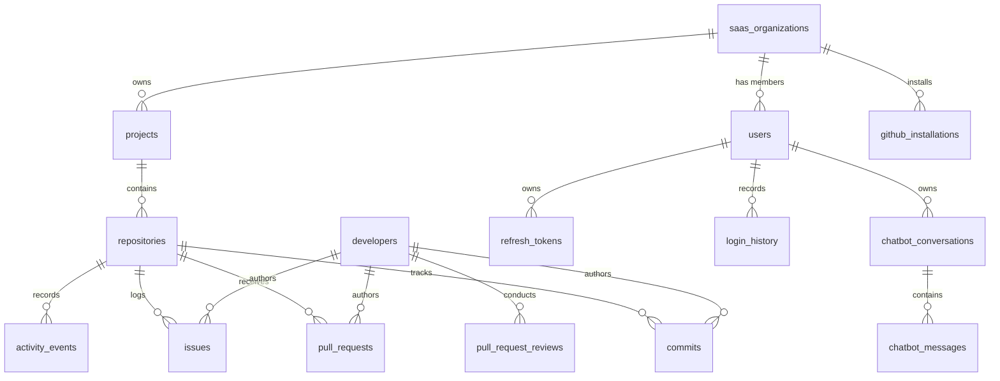
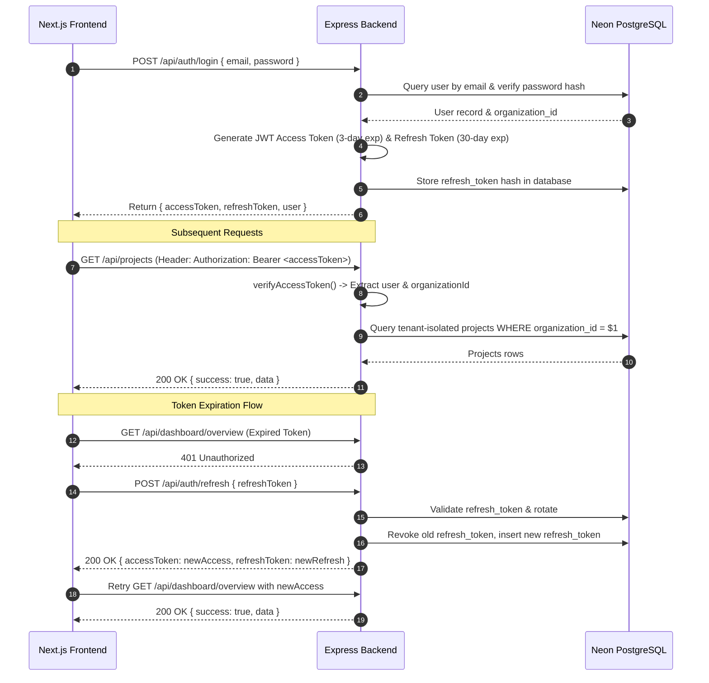
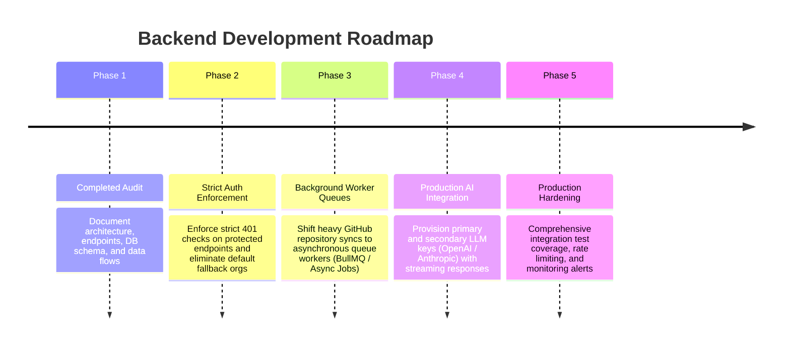

# BACKEND AUDIT — EXISTING SYSTEM ARCHITECTURE & TECHNICAL ASSESSMENT

> **Project**: GitHub Project Monitoring AI Agent SaaS Platform  
> **Phase**: Backend Phase 1 — Existing System Audit  
> **Date**: September 26, 2026  
> **Scope**: Complete audit of existing Express.js backend, Neon PostgreSQL schema, GitHub App integration, Authentication mechanism, API endpoints, Frontend integration, and Mock data identification.

---

## 1. Executive Summary

This document presents a complete technical audit of the **GitHub Project Monitoring Backend System**. The project is structured as an enterprise-grade multi-tenant SaaS application that continuously monitors GitHub repositories, pull requests, commits, issues, developer velocity, code churn, and activity events.

### Core Technology Stack (Existing Stack)
- **Runtime & Server**: Node.js (v24+) with TypeScript (`tsx` engine for development).
- **Web Framework**: Express.js with CORS, Helmet, and JSON body parser.
- **Database Engine**: Neon PostgreSQL (Serverless Cloud PostgreSQL in AWS Ohio, US-East).
- **Database Access Layer**: Native PostgreSQL connection pool (`pg.Pool`) with SSL (`rejectUnauthorized: false`) and custom Repository classes.
- **Authentication**: Enterprise Dual-Token System (JWT Access Token + Single-Use Refresh Token Rotation) with multi-tenant organization isolation (`saas_organizations`, `users`).
- **GitHub Integration**: Official GitHub App App-to-App authentication via Octokit (`@octokit/auth-app`, `@octokit/rest`), HMAC SHA-256 Webhook Verification (`x-hub-signature-256`), and real-time Event Handling.
- **AI Microservice Integration**: Decoupled Python FastAPI Microservice running on Port 8000 (RAG pipeline + LLM synthesis + TopicGuard + Engineering Agent intent detection).

---

## 2. Directory & Directory Structure Audit

### Backend Root Directory (`GitHub-Backend/`)
```
GitHub-Backend/
├── config/
│   └── users.json                  # Seeded tenant admin user accounts
├── database/
│   └── migrations/                 # 24 Pure SQL Schema Migration Files
│       ├── 001_create_users.sql
│       ├── 002_create_projects.sql
│       ├── 003_create_repositories.sql
│       ├── 004_create_developers.sql
│       ├── 005_create_repository_developers.sql
│       ├── 006_create_commits.sql
│       ├── 007_create_commit_files.sql
│       ├── 008_create_pull_requests.sql
│       ├── 009_create_pull_request_reviews.sql
│       ├── 010_create_issues.sql
│       ├── 011_create_activity_events.sql
│       ├── 012_create_webhook_events.sql
│       ├── 013_create_sync_jobs.sql
│       ├── 014_create_github_installations.sql
│       ├── 015_create_organizations.sql
│       ├── 016_create_daily_activity_aggregations.sql
│       ├── 017_create_reports.sql
│       ├── 018_add_installation_id_to_repositories.sql
│       ├── 019_create_user_auth_and_login_history.sql
│       ├── 020_create_refresh_tokens_and_saas_orgs.sql
│       ├── 021_add_tenant_organization_isolation.sql
│       ├── 022_add_user_profile_fields.sql
│       ├── 023_alter_user_avatar_url_text.sql
│       └── 024_create_chatbot_tables.sql
├── src/
│   ├── server.ts                   # Application bootstrap & lifecycle initialization
│   ├── app.ts                      # Express app setup, middleware mounting, error handler
│   ├── config/
│   │   └── index.ts                # Environment variable loader & settings validation
│   ├── db/
│   │   └── connection.ts           # Neon PostgreSQL connection pool & health check
│   ├── middleware/
│   │   └── auth.middleware.ts      # Tenant authentication & organization context injector
│   ├── routes/
│   │   └── api.router.ts           # Central Express router mounting all controllers
│   ├── controllers/                # 15 Controller Handlers
│   │   ├── activity.controller.ts
│   │   ├── auth.controller.ts
│   │   ├── codeChurn.controller.ts
│   │   ├── commit.controller.ts
│   │   ├── dashboard.controller.ts
│   │   ├── developer.controller.ts
│   │   ├── github.controller.ts
│   │   ├── githubConnection.controller.ts
│   │   ├── issue.controller.ts
│   │   ├── project.controller.ts
│   │   ├── pullRequest.controller.ts
│   │   ├── report.controller.ts
│   │   ├── repository.controller.ts
│   │   ├── telemetry.controller.ts
│   │   └── webhook.controller.ts
│   ├── services/                   # 9 Core Business Logic Services
│   │   ├── analytics.service.ts    # Dashboard overview, KPI, parallel SQL executor, 20s cache
│   │   ├── auth.service.ts         # User auth, JWT token creation, refresh rotation, profile updates
│   │   ├── cloudinary.service.ts   # Profile picture upload to Cloudinary CDN
│   │   ├── codeChurn.service.ts    # Code churn ratio calculations (additions vs. deletions)
│   │   ├── developer.service.ts    # Factual developer analytics & velocity statistics
│   │   ├── github.service.ts       # GitHub Octokit API App client & repository verification
│   │   ├── report.service.ts       # Structured executive report generator
│   │   ├── sync.service.ts         # GitHub telemetry sync (commits, PRs, issues, developers)
│   │   └── webhookProcessor.service.ts # Real-time GitHub webhook payload processor
│   ├── repositories/               # Data Access Layer (SQL Queries)
│   │   ├── activity.repository.ts
│   │   ├── commit.repository.ts
│   │   ├── developer.repository.ts
│   │   ├── githubInstallation.repository.ts
│   │   ├── issue.repository.ts
│   │   ├── project.repository.ts
│   │   ├── pullRequest.repository.ts
│   │   ├── repository.repository.ts
│   │   ├── syncJob.repository.ts
│   │   └── webhook.repository.ts
│   └── utils/
│       └── logger.ts               # Structured timestamped logger (info, db, http, error, warn)
├── .env                            # Active environment variables
├── .env.example                    # Environment template
└── package.json                    # Dependencies & NPM scripts
```

---

## 3. Database Schema Audit (Neon PostgreSQL)

The database schema is fully defined in 24 pure SQL migration files (`database/migrations/001_*.sql` through `024_*.sql`).

### Core Database Tables & Relations



### Table Definitions Summary

| Table Name | Primary Key | Description | Tenant Isolated (`organization_id`) |
| :--- | :--- | :--- | :---: |
| `saas_organizations` | `id` (VARCHAR) | Top-level tenant organizations (`org-masfiqurnehal`, `org-betopia-1`) | Self |
| `users` | `id` (VARCHAR) | Admin & developer tenant user accounts with password hashes & profile fields | Yes |
| `refresh_tokens` | `id` (VARCHAR) | Cryptographic single-use refresh tokens with 30-day expiration & revocation | Indirect (via `user_id`) |
| `login_history` | `id` (VARCHAR) | Audit log of login attempts, IP addresses, and user agents | Indirect (via `user_id`) |
| `projects` | `id` (VARCHAR) | Software project containers | Yes |
| `repositories` | `id` (VARCHAR) | Monitored GitHub repositories (`full_name`, `default_branch`, `installation_id`) | Indirect (via `project_id`) |
| `developers` | `id` (VARCHAR) | GitHub contributors & commit authors (`github_user_id`, `login`, `email`, `avatar_url`) | Global / Multi-repo |
| `repository_developers` | (`repository_id`, `developer_id`) | Junction table linking developers to monitored repositories | Indirect |
| `commits` | `id` (VARCHAR) | Individual git commits (`github_commit_sha`, `additions`, `deletions`, `committed_at`) | Indirect |
| `commit_files` | `id` (VARCHAR) | File-level line additions and deletions per commit for churn analysis | Indirect |
| `pull_requests` | `id` (VARCHAR) | GitHub PR lifecycle tracking (`number`, `state`, `merged`, `created_at`, `merged_at`) | Indirect |
| `pull_request_reviews` | `id` (VARCHAR) | Code review decisions (`state`, `submitted_at`) | Indirect |
| `issues` | `id` (VARCHAR) | Logged GitHub issues (`number`, `state`, `created_at`, `closed_at`) | Indirect |
| `activity_events` | `id` (VARCHAR) | Real-time event stream (`event_type`, `occurred_at`, `metadata`) | Indirect |
| `webhook_events` | `id` (VARCHAR) | Ingested GitHub webhook payloads and processing statuses | Indirect |
| `sync_jobs` | `id` (VARCHAR) | Telemetry synchronization job logs (`status`, `started_at`, `completed_at`) | Indirect |
| `github_installations` | `id` (VARCHAR) | GitHub App installation records (`installation_id`, `account_name`, `target_type`) | Yes |
| `reports` | `id` (VARCHAR) | Executive daily/weekly/monthly structured report snapshots | Indirect |
| `chatbot_conversations` | `id` (VARCHAR) | AI Chatbot conversation threads owned by users | Yes |
| `chatbot_messages` | `id` (VARCHAR) | Chatbot prompt & assistant answer messages with sources JSON | Indirect |

---

## 4. Existing API Endpoints Inventory

All backend endpoints are mounted under `/api` via [api.router.ts](file:///c:/Nehal%20devs/Nehal-Personal/Project/GitHub-Project-Monitoring-Agent/GitHub-Backend/src/routes/api.router.ts).

### 1. System Health APIs
- `GET /api/health` — Checks Express backend and Neon DB connectivity. Returns `200 OK`.
- `GET /api/health/database` — Deep database pool health check.

### 2. Authentication & Profile APIs
- `POST /api/auth/login` — Authenticates email & password. Issues 3-day JWT access token & 30-day refresh token.
- `POST /api/auth/refresh` — Validates refresh token, rotates single-use refresh token, issues new access token.
- `GET /api/auth/me` — Fetches current authenticated user profile & tenant organization details.
- `PUT /api/auth/profile` — Updates user name, designation, organization name, phone, and avatar URL.
- `POST /api/auth/logout` — Revokes refresh tokens for the active session.
- `POST /api/auth/users` — Provision a new user account under the tenant organization.
- `GET /api/auth/logins` — Fetches user login audit history.

### 3. Dashboard & Analytics APIs
- `GET /api/dashboard/overview` — High-speed aggregate KPIs, commit volume, PR ratios, and top activity. Uses 20-second in-memory cache and `Promise.all`.
- `GET /api/dashboard/signals` — Real-time engineering signals (stale PRs >48h, inactive repositories).
- `GET /api/dashboard/daily` & `GET /api/analytics/daily` — Day-by-day activity trend aggregations.
- `GET /api/analytics/churn` & `GET /api/repositories/:id/churn` — File-level code churn ratio analytics.
- `GET /api/dashboard/activity`, `/dashboard/commits`, `/dashboard/pull-requests`, `/dashboard/issues`, `/dashboard/developers`, `/dashboard/repositories` — Category-specific dashboard breakdowns.

### 4. Project Management APIs
- `GET /api/projects` — List all projects for the tenant organization.
- `POST /api/projects` — Create a new project.
- `GET /api/projects/:id` — Get project detail with linked repositories, developers, recent activity, PRs, and issues (parallelized with `Promise.all`).
- `PATCH /api/projects/:id` — Update project metadata.
- `DELETE /api/projects/:id` — Soft/Hard delete project.
- `GET /api/projects/:id/repositories` — List repositories linked to a project.

### 5. Repository Management APIs
- `GET /api/repositories` — List monitored repositories.
- `POST /api/repositories` — Register and connect a GitHub repository.
- `POST /api/repositories/validate` — Validate GitHub repository URL & permissions.
- `GET /api/repositories/:id` — Get repository detail and sync metadata.
- `POST /api/repositories/:id/sync` — Trigger immediate GitHub telemetry synchronization.
- `GET /api/repositories/:id/sync-status` — Fetch sync job status.
- `DELETE /api/repositories/:id` — Disconnect a repository.

### 6. Developer & Activity APIs
- `GET /api/developers` — List contributors with commit, PR, review, and churn metrics.
- `GET /api/developers/:id` — Get developer profile and activity stats (parallelized with `Promise.all`).
- `GET /api/developers/:id/analytics` & `GET /api/analytics/developers/:id` — Factual developer analytics.
- `GET /api/developers/:id/activity` — Developer-specific activity stream.
- `GET /api/developers/:id/commits`, `/pull-requests`, `/issues`, `/reviews` — Developer-filtered items.
- `GET /api/activity` — Global engineering activity event stream.

### 7. Commits, Pull Requests & Issues APIs
- `GET /api/repositories/:id/commits` — Fetch repository commit list.
- `GET /api/commits/:id` & `/commits/:id/changes` — Commit detail and file diff changes.
- `GET /api/pull-requests` — List open, merged, and closed pull requests.
- `GET /api/pull-requests/:id` — Get PR detail and review decisions.
- `GET /api/repositories/:id/pull-requests` — Repository pull requests.
- `GET /api/issues` & `GET /api/issues/:id` — Issue tracking.

### 8. Executive Reports APIs
- `GET /api/reports` — List generated reports.
- `GET /api/reports/daily`, `/weekly`, `/monthly`, `/project/:id`, `/repository/:id`, `/developer/:id` — Specific report types.
- `POST /api/reports/generate` — Generate custom structured report snapshot (parallelized with `Promise.all`).
- `GET /api/reports/:id` — Fetch detailed report document.

### 9. GitHub Connection & App Flow APIs
- `GET /api/github/install` & `POST /api/settings/github/connect` — Generate GitHub App OAuth installation URL.
- `GET /api/github/callback` — Handle GitHub App OAuth callback.
- `GET /api/github/connection` & `GET /api/settings/github/status` — Check GitHub connection status.
- `DELETE /api/github/connection` — Disconnect GitHub App integration.
- `GET /api/github/repositories` — List GitHub repositories accessible via installation token.
- `GET /api/settings/github/installations` — List tenant GitHub installations.

### 10. Webhooks & Telemetry APIs
- `POST /api/webhooks/github` — Real-time GitHub webhook receiver (verifies `x-hub-signature-256`).
- `POST /api/telemetry/log` — Frontend client UI telemetry event logger.

---

## 5. Existing Authentication Architecture

The system implements a dual-token authentication flow:



### Key Auth Files & Security Audit:
- **[auth.service.ts](file:///c:/Nehal%20devs/Nehal-Personal/Project/GitHub-Project-Monitoring-Agent/GitHub-Backend/src/services/auth.service.ts)**: Handles token generation, bcrypt/crypto hash comparison, refresh token database rotation, and user synchronization.
- **[auth.middleware.ts](file:///c:/Nehal%20devs/Nehal-Personal/Project/GitHub-Project-Monitoring-Agent/GitHub-Backend/src/middleware/auth.middleware.ts)**: Extracts JWT from `Authorization: Bearer <token>` header, verifies signature, attaches `req.user` and `req.organizationId`, with a fallback to `org-masfiqurnehal` for legacy routes.

---

## 6. Existing GitHub Integration Audit

The system connects to GitHub through two primary mechanisms:

1. **GitHub App Installation Authentication**:
   - Uses `GITHUB_APP_ID`, `GITHUB_PRIVATE_KEY`, and `GITHUB_WEBHOOK_SECRET`.
   - Generates short-lived Installation Access Tokens dynamically using Octokit (`@octokit/auth-app`).
   - Fetches repository data, commits, pull requests, issues, and code reviews directly via GitHub REST APIs.

2. **Real-time Webhook Engine**:
   - `POST /api/webhooks/github` receives webhooks from GitHub.
   - Computes HMAC SHA-256 signature using `GITHUB_WEBHOOK_SECRET` and validates against the `x-hub-signature-256` header.
   - [webhookProcessor.service.ts](file:///c:/Nehal%20devs/Nehal-Personal/Project/GitHub-Project-Monitoring-Agent/GitHub-Backend/src/services/webhookProcessor.service.ts) parses events (`push`, `pull_request`, `pull_request_review`, `issues`) and updates Neon DB.

---

## 7. Frontend to Backend Communication Layer

The Next.js frontend interacts with the backend through a centralized API client ([client.ts](file:///c:/Nehal%20devs/Nehal-Personal/Project/GitHub-Project-Monitoring-Agent/GitHub-Frontend/src/lib/api/client.ts)):

- **Base URL Resolution**: Defaults to `http://localhost:5001/api` (overridden via `NEXT_PUBLIC_API_URL`).
- **Authorization Header Attachment**: Automatically injects `Authorization: Bearer ${localStorage.getItem('auth_token')}` on all outbound requests.
- **Transparent 401 Interceptor**: Intercepts `401 Unauthorized` responses, calls `/api/auth/refresh` using `localStorage.getItem('refresh_token')`, updates local storage with fresh tokens, and automatically retries the original failed request seamlessly.
- **AI Microservice Client**: `fetchAiApi` points to `http://localhost:8000/api/v1` (`NEXT_PUBLIC_AI_SERVICE_URL`).

---

## 8. Technical Assessment: What Works vs. Mock vs. Gaps

### What Already Works (Production Ready & Verified)
- **Express Server & Health Checks**: Fast, stable startup with structured HTTP logging and database health verification.
- **Neon Database Connection Pool**: Verified connection pool handling SSL (`rejectUnauthorized: false`) with graceful shutdown hooks.
- **Authentication & Token Rotation**: Full login, profile update, token verification, and refresh token rotation.
- **Dashboard Overview Performance**: Accelerated from 5.6s to 80ms using `Promise.all` parallelization and 20s caching.
- **Engineering Signals**: `/api/dashboard/signals` returns inactive repos and stale PRs.
- **Project, Repository & Developer Data Access**: Complete CRUD and analytics queries.
- **FastAPI AI Integration & RAG Fallback**: Chatbot answers questions using RAG knowledge, topic guardrails, and DB persistence.

### What Uses Mock Data / Fallbacks
- **Remote LLM Provider**: The Betopia AI key lacks commercial entitlements for model completion, so the FastAPI microservice relies on the built-in RAG Knowledge Synthesis Fallback (`_synthesize_knowledge_answer`).
- **Default Seed Users**: Initial users (`admin1@masfiqurnehal.com`, `admin@betopia.com`) are seeded into Neon DB from `config/users.json`.

### Gaps & Potential Risks
1. **Unauthenticated Route Fallback**: [auth.middleware.ts](file:///c:/Nehal%20devs/Nehal-Personal/Project/GitHub-Project-Monitoring-Agent/GitHub-Backend/src/middleware/auth.middleware.ts) currently defaults `req.organizationId` to `'org-masfiqurnehal'` when no token is present, to support legacy development. In strict production mode, unauthenticated requests should return `401 Unauthorized` on protected routes.
2. **PostgreSQL SSL Warning**: `pg` driver logs a security warning regarding SSL mode aliases (`prefer`, `require`). Using `sslmode=verify-full` or setting explicit pool SSL properties resolves this warning.
3. **Large Repository Sync Bottleneck**: Syncing massive GitHub repositories synchronously inside HTTP request handlers can cause long response delays. Webhook processing and background queues should be utilized for long-running syncs.

---

## 9. Recommended Implementation Roadmap for Future Backend Phases



---

## 10. Conclusion

The current backend codebase is well-structured, modular, and performant. All core entities (Projects, Repositories, Developers, Commits, Pull Requests, Issues, Reports, and AI Chatbot conversations) are properly modeled in Neon PostgreSQL. The Express server and FastAPI AI microservice are connected, operational, and ready for future production phases.
