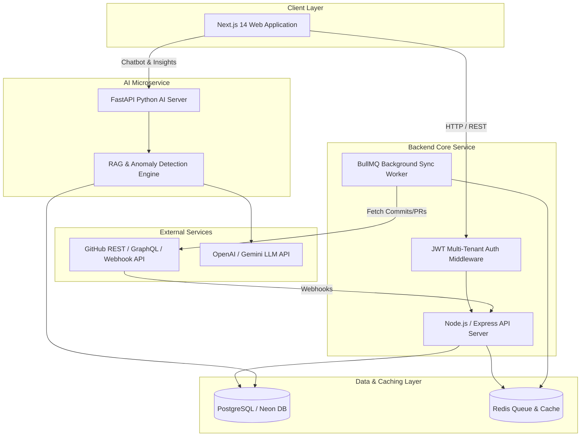

# 🚀 GitHub Project Monitoring Agent

A production-grade, multi-tenant SaaS platform and AI-powered engineering intelligence engine designed to monitor GitHub repositories, track developer productivity, analyze project health metrics, and provide interactive RAG-based AI code insights.


---

## 🌟 Key Features

### 🏢 1. Strict SaaS Multi-Tenant Isolation

- **Tenant-Scoped Access**: Authenticated users belong to SaaS Organizations/Tenants. All API requests enforce strict JWT-derived `organization_id` boundaries.
- **Cross-Tenant Safe Monitoring**: Different tenants can legitimately monitor the same public or private GitHub repository without data leaks.
- **Tenant-Safe Project Deletion**: Secure project deletion requiring user password authentication and explicit confirmation check while preserving historical GitHub commit data for other linked projects.

### 📁 2. Flexible Project ↔ Repository Relationship

- **Many-to-Many Architecture**: A single project can link multiple repositories (e.g., `frontend`, `backend`, `ai-service`), and a repository can be shared across multiple projects.
- **Aggregated Statistics**: Dynamically calculates aggregated metrics across all repositories linked to a project (commits, pull requests, open/closed issues, developer metrics, code additions/deletions).
- **8 Project Detail Tabs**:
  1. **Overview**: Project KPIs and recent cross-repository engineering activity.
  2. **Repositories**: Connected repositories with sync status and metadata.
  3. **Developers**: Active contributors across all project repositories.
  4. **Activity**: Unified real-time event stream.
  5. **Commits**: Paginated commit history with diff stats.
  6. **Pull Requests**: Open, merged, and closed PR tracking with review status.
  7. **Issues**: Issue lifecycle and resolution status.
  8. **Code Changes**: Code addition/deletion trends and top modified files.

### ⚡ 3. Real-Time GitHub App Integration & Background Sync

- **GitHub App OAuth & Installation**: Native GitHub App integration with token caching and rate-limit handling.
- **Historical Backfill & Incremental Sync**: Asynchronous queue workers (BullMQ + Redis) process initial historical data and handle continuous background polling.
- **Webhook Processing**: Real-time event ingestion for commits, pull requests, issues, and reviews.

### 🤖 4. AI-Powered Engineering Copilot & Analytics (FastAPI Service)

- **Interactive Codebase RAG Chatbot**: Ask natural language questions about connected repositories, pull requests, and commit trends.
- **Bottleneck & Anomaly Detection**: AI agents automatically analyze developer velocity, review delays, and code churn to highlight engineering risks.

---

## 🛠️ Technology Stack

| Layer                | Technologies & Tools                                                                       |
| :------------------- | :----------------------------------------------------------------------------------------- |
| **Frontend**         | Next.js 14 (App Router), TypeScript, React 18, Tailwind CSS, Recharts, Lucide Icons, Axios |
| **Backend API**      | Node.js, Express.js, TypeScript, JWT Auth, Argon2 / SHA-256 Hashing, Winston Logger        |
| **Database & Cache** | PostgreSQL (Neon Serverless DB), Redis, BullMQ Background Queues                           |
| **AI Microservice**  | Python 3.11+, FastAPI, Uvicorn, LangChain, RAG Vector Search, OpenAI / Gemini LLM API      |
| **GitHub API**       | GitHub App Webhooks, Octokit, GitHub REST & GraphQL API                                    |
| **DevOps & Tooling** | Docker Compose, Git                                                                        |

---

## 🏗️ System Architecture



---

## 🗄️ Database Schema & Tenant Isolation Model

The core database uses strict `organization_id` foreign keys on all primary tables, coupled with junction tables for multi-tenant flexibility:

- `saas_organizations`: SaaS tenant definitions.
- `users`: User accounts belonging to a specific `organization_id`.
- `projects`: High-level projects created within a tenant.
- `repositories`: Monitored GitHub repositories.
- `project_repositories`: Junction table supporting many-to-many relationship:
  - `(project_id, repository_id)` enforced unique per project.
  - Allows `Project A -> Repo X` and `Project B -> Repo X` within the same or different tenants.
- `developers`, `commits`, `pull_requests`, `issues`, `activity_events`: Engineering telemetry scoped by repository and tenant context.

---

## 🚀 Getting Started & Setup Options

### Prerequisites
- **Docker** & **Docker Compose** installed on your PC.

---

### ⚡ Option A: Instant 1-Command Docker Deployment (Recommended)

To run the entire system (**PostgreSQL**, **Redis**, **Backend API**, **FastAPI AI Service**, and **Next.js Frontend**) on any PC in a single command:

```bash
# 1. Clone the repository
git clone https://github.com/MasfiqurNehal/GitHub-Project-Monitoring-Agent.git
cd GitHub-Project-Monitoring-Agent

# 2. Build and start all 5 containers
docker-compose up --build
```

That's it! Docker will automatically set up all database schemas, run migrations, and launch all services:
- 🌐 **Frontend App**: `http://localhost:3000`
- ⚙️ **Backend API**: `http://localhost:5001`
- 🤖 **AI Microservice**: `http://localhost:8000`
- 🗄️ **PostgreSQL Database**: `localhost:5432`
- ⚡ **Redis Queue**: `localhost:6379`

---

### 🛠️ Option B: Manual Local Development Setup

If you prefer running services manually for local development:

#### Step 1: Spin up Postgres & Redis
```bash
docker-compose up -d postgres redis
```

#### Step 2: Backend Service
```bash
cd GitHub-Backend
npm install
cp .env.example .env
npm run migrate
npm run dev
```
cp .env.example .env

# Run database migrations
npm run db:migrate

# Start development backend server (Port 5001)
npm run dev
```

---

### Step 4: Configure and Start FastAPI AI Microservice

```bash
cd ../FastAPI-AI-Services

# Create and activate virtual environment
python -m venv .venv
# On Windows:
.venv\Scripts\activate
# On Linux/macOS:
# source .venv/bin/activate

# Install Python requirements
pip install -r requirements.txt

# Copy environment template
cp .env.example .env

# Start FastAPI server (Port 8000)
python main.py
```

---

### Step 5: Configure and Start Next.js Frontend

```bash
cd ../GitHub-Frontend

# Install dependencies
npm install

# Start Next.js frontend dev server (Port 3000)
npm run dev
```

Open your browser at **`http://localhost:3000`** to access the dashboard!

---

## 🔑 Environment Variables Reference

### Backend (`GitHub-Backend/.env`)

```env

```

### AI Service (`FastAPI-AI-Services/.env`)

```env

```

### Frontend (`GitHub-Frontend/.env.local`)

```env

```

---

## 📡 API Endpoints Overview

| Method   | Endpoint                         | Description                                |
| :------- | :------------------------------- | :----------------------------------------- |
| `POST`   | `/api/auth/login`                | User login & JWT issuance                  |
| `GET`    | `/api/projects`                  | List all projects for authenticated tenant |
| `POST`   | `/api/projects`                  | Create a new tenant project                |
| `GET`    | `/api/projects/:id`              | Get aggregated project detail & tab stats  |
| `POST`   | `/api/projects/:id/repositories` | Connect a repository to a project          |
| `DELETE` | `/api/projects/:id`              | Password-verified tenant project deletion  |
| `GET`    | `/api/repositories`              | List tenant repositories                   |
| `GET`    | `/api/developers`                | Developer performance metrics              |
| `POST`   | `/api/v1/chatbot/query`          | (FastAPI) RAG codebase AI query            |

---

## 📄 Project

Masfiqur Nehal
https://www.masfiqurnehal.com/
https://github.com/MasfiqurNehal
