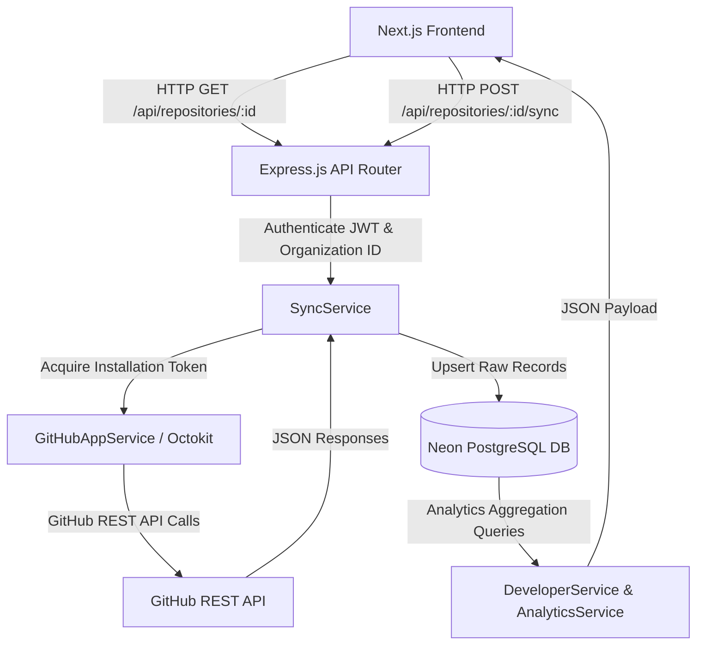
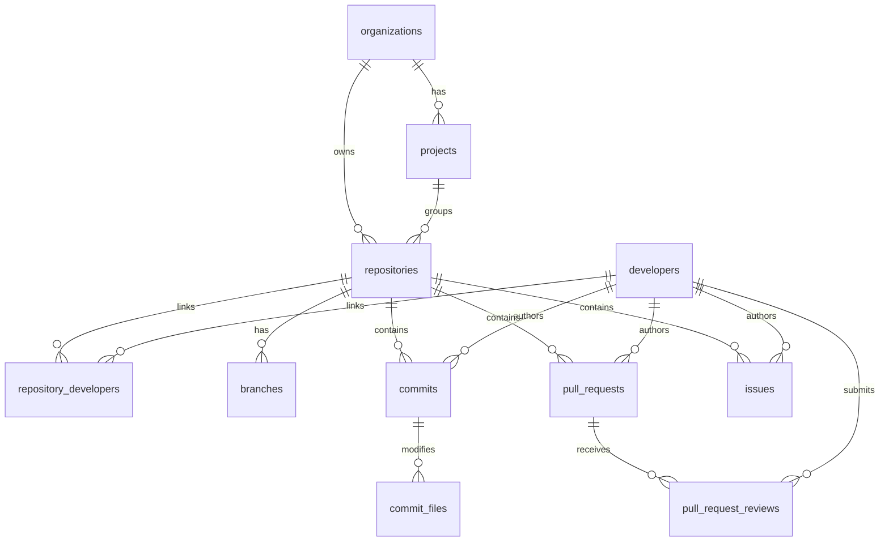

# Developer Analytics & Synchronization Data Flow Audit

## Executive Summary
This document provides a comprehensive, end-to-end diagnostic audit of the existing **GitHub Repository Synchronization & Developer Analytics Pipeline** in GitMonitor AI.

The audit was conducted strictly against live system behavior, actual PostgreSQL records (Neon DB), Express.js backend services, and GitHub REST API responses using the active GitHub App installation (`Installation ID: 164021978`).

---

## 1. Current Synchronization Architecture



---

## 2. Current GitHub API Endpoints Used

| API Method | GitHub REST Endpoint | Purpose |
| :--- | :--- | :--- |
| `githubClient.validateRepositoryAccess` | `GET /repos/{owner}/{repo}` | Fetches repo metadata (default branch, visibility, stars, open issues count). |
| `githubClient.getBranches` | `GET /repos/{owner}/{repo}/branches` | Fetches list of all branches (`name`, `protected`, `commit.sha`). |
| `githubClient.getContributors` | `GET /repos/{owner}/{repo}/contributors` | Fetches contributors list (`id`, `login`, `avatar_url`, `html_url`). |
| `githubClient.getCommits` | `GET /repos/{owner}/{repo}/commits` | Fetches repository commits (with optional `since`, `page`, `per_page`). |
| `githubClient.getCommitDetail` | `GET /repos/{owner}/{repo}/commits/{sha}` | Fetches detailed commit line stats (`additions`, `deletions`, `files`). |
| `githubClient.getPullRequests` | `GET /repos/{owner}/{repo}/pulls` | Fetches pull requests (`state`, `user`, `merged_at`, `created_at`). |
| `githubClient.getPullRequestReviews` | `GET /repos/{owner}/{repo}/pulls/{pull_number}/reviews` | Fetches reviews submitted per pull request. |
| `githubClient.getIssues` | `GET /repos/{owner}/{repo}/issues` | Fetches repository issues (excluding pull request items). |

---

## 3. Current Database Tables Involved

1. `organizations`: Tenant / Account root.
2. `projects`: Project container scoped to an organization.
3. `repositories`: Monitored GitHub repository records (`id`, `full_name`, `default_branch`, `last_synced_at`, `sync_status`).
4. `developers`: Global developer identity records (`id`, `github_user_id`, `login`, `name`, `avatar_url`, `html_url`, `email`).
5. `repository_developers`: Many-to-many junction linking repositories to developers (`repository_id`, `developer_id`, `first_seen_at`, `last_seen_at`).
6. `branches`: Monitored git branches (`id`, `repository_id`, `name`, `is_default`, `is_protected`, `head_sha`).
7. `commits`: Synchronized commits (`id`, `repository_id`, `github_commit_sha`, `developer_id`, `message`, `committed_at`, `additions`, `deletions`, `changed_files`).
8. `commit_files`: Line diffs per file (`id`, `commit_id`, `filename`, `additions`, `deletions`, `status`).
9. `pull_requests`: Synchronized pull requests (`id`, `repository_id`, `github_pr_id`, `number`, `author_developer_id`, `title`, `state`, `merged`, `created_at`, `closed_at`, `merged_at`).
10. `pull_request_reviews`: Synchronized code reviews (`id`, `pull_request_id`, `reviewer_developer_id`, `state`, `submitted_at`).
11. `issues`: Synchronized GitHub issues (`id`, `repository_id`, `github_issue_id`, `number`, `author_developer_id`, `title`, `state`, `created_at`, `closed_at`).
12. `activity_events`: Audit & activity feed records (`id`, `repository_id`, `developer_id`, `event_type`, `occurred_at`, `metadata`).

---

## 4. Current Database Relationships



---

## 5. Current Data Flows

### A. Developer Data Flow
1. `githubClient.getContributors` retrieves contributor user objects (`id`, `login`, `avatar_url`).
2. `developerRepository.upsert` inserts or updates `developers` using `login` as the unique key and `github_user_id` (`id`).
3. `developerRepository.linkToRepository` inserts into `repository_developers` (`repository_id`, `developer_id`).

### B. Commit Data Flow
1. `syncService.runFullHistoricalSync` calls `githubClient.getCommits(owner, repo, sinceDate, page, perPage)`.
2. For each commit, author identity is upserted into `developers` and linked in `repository_developers`.
3. `githubClient.getCommitDetail(owner, repo, sha)` fetches line statistics (`additions`, `deletions`, `files`).
4. `commitRepository.upsert` persists commit into `commits` table.

### C. PR, Review & Issue Data Flows
1. `githubClient.getPullRequests` fetches PRs -> `pullRequestRepository.upsert` stores in `pull_requests`.
2. `githubClient.getPullRequestReviews` fetches reviews per PR -> `pull_request_reviews` table.
3. `githubClient.getIssues` fetches issues -> `issueRepository.upsert` stores in `issues`.

---

## 6. Current Developer Detail API & Frontend Mapping

- **Endpoint**: `GET /api/developers/:id` (`developerController.getDeveloperDetail`)
- **Service**: `developerService.getDeveloperDetail(developerId, filters)`
- **Queries Executed**:
  - `commitStats`: `COUNT(*)`, `AVG(additions)`, `SUM(additions)`, `SUM(deletions)` from `commits` where `developer_id = $1`.
  - `prStats`: `COUNT(*)`, `merged_prs`, `open_prs` from `pull_requests` where `author_developer_id = $1`.
  - `reviewStats`: `COUNT(*)`, `approved`, `changes_requested` from `pull_request_reviews` where `reviewer_developer_id = $1`.
  - `issueStats`: `COUNT(*)`, `open_issues`, `closed_issues` from `issues` where `author_developer_id = $1`.
  - `activityDistribution`: Daily breakdown of commits, PRs, reviews, issues grouped by `YYYY-MM-DD`.
  - `activityTimeline`: Event feed ordered by `occurred_at DESC`.

---

## 7. Diagnostic Database & API Inspection Results

Live inspection script (`audit_db.js` and `test_github_fetch.js`) revealed:

1. **Total Repositories in DB**: `7` (`MasfiqurNehal/Nexora-AI`, `MasfiqurNehal/expressJS-operation`, `MasfiqurNehal/Dead-ZONE`, etc.).
2. **Total Developers in DB**: `446`.
3. **Total Pull Requests in DB**: `500` (all belonging to `octocat/Hello-World`).
4. **Total Commits in DB**: `0` across ALL repositories!

---

## 8. Exact Root Cause of Zero Developer Metrics

### Primary Root Cause
In [`src/services/sync.service.ts`](file:///c:/Nehal%20devs/Nehal-Personal/Project/GitHub-Project-Monitoring-Agent/GitHub-Backend/src/services/sync.service.ts):

Line 74:
```typescript
const sinceDate = repo.last_synced_at ? repo.last_synced_at.toISOString() : undefined;
```

When a repository was registered or updated in PostgreSQL, `last_synced_at` was set to the current date/time (e.g. `2026-09-26T16:42:00Z`).

When manual sync (`POST /api/repositories/:id/sync`) or periodic sync was triggered:
```typescript
const commits = await githubClient.getCommits(repo.owner, repo.name, sinceDate, commitPage, 100);
```
`getCommits` issued `GET /repos/{owner}/{repo}/commits?since=2026-09-26T16:42:00Z` to GitHub.

Because all existing commits in target repositories (such as `MasfiqurNehal/Nexora-AI` and `MasfiqurNehal/expressJS-operation`) were committed prior to September 26, 2026 (e.g., `2026-06-29T10:03:25Z`), GitHub returned `[]` (0 commits).

Because GitHub returned 0 commits:
- 0 rows were inserted into table `commits`.
- 0 line additions/deletions were calculated.
- All developer analytics queries (`commitsCount`, `linesAdded`, `linesDeleted`, `code impact`, and `activityDistribution`) evaluated to `0`.

---

## 9. Files That Need Modification

1. [`GitHub-Backend/src/services/sync.service.ts`](file:///c:/Nehal%20devs/Nehal-Personal/Project/GitHub-Project-Monitoring-Agent/GitHub-Backend/src/services/sync.service.ts)
   - In `runFullHistoricalSync`, do NOT pass `sinceDate` on historical sync, OR pass `sinceDate = undefined` for full historical sync so all repository commits are retrieved.

2. [`GitHub-Backend/src/repositories/repository.repository.ts`](file:///c:/Nehal%20devs/Nehal-Personal/Project/GitHub-Project-Monitoring-Agent/GitHub-Backend/src/repositories/repository.repository.ts)
   - Ensure `last_synced_at` is only updated *after* a sync completes successfully, rather than when the repository row is initially inserted.

---

## 10. Recommended Implementation Order

1. Fix `sinceDate` handling in `SyncService.runFullHistoricalSync` so full historical commit lists are retrieved from GitHub.
2. Trigger sync on monitored repositories (`POST /api/repositories/:id/sync`).
3. Verify that commit records and additions/deletions are populated in PostgreSQL.
4. Verify that developer detail pages display real commit counts, code impact, and activity charts.

---

AUDIT COMPLETE
