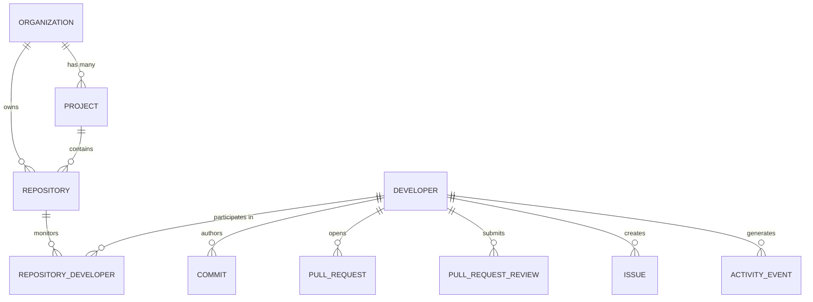

# Developer Analytics Implementation

## Overview
This document details the architecture, database relationships, backend aggregation queries, API endpoints, frontend mapping, filtering mechanisms, and verification tests for the **REAL Developer Analytics Pipeline**. All metrics and activity streams are calculated 100% dynamically from PostgreSQL data populated by GitHub synchronization, with zero fallback fake/mock data and no modification of GitHub data.

---

## 1. Database Relationships & Multi-Repository Model



### Core Integrity Guarantees:
1. **Unique Developer Identity**: Developers are stored uniquely by `login` and `github_user_id` in the `developers` table. A developer is **never duplicated** across multiple repositories.
2. **Junction Association**: The `repository_developers` table manages the many-to-many relationship (`repository_id`, `developer_id`), recording first/last activity timestamps.
3. **Multi-Project & Multi-Repo Aggregation**: Associated projects and repositories are dynamically resolved via SQL joins against monitored repositories.

---

## 2. Express Backend Aggregation Queries

All developer metrics are calculated directly via PostgreSQL queries in `DeveloperRepository` and `DeveloperService`:

### A. Total Commits & Code Impact
```sql
SELECT 
  COUNT(*) as count, 
  COALESCE(SUM(c.additions), 0) as additions, 
  COALESCE(SUM(c.deletions), 0) as deletions, 
  COALESCE(SUM(c.changed_files), 0) as changed_files 
FROM commits c 
JOIN repositories r ON r.id = c.repository_id 
WHERE c.developer_id = $1 
  [AND r.project_id = $2]
  [AND c.repository_id = $3]
  [AND c.committed_at >= $4]
  [AND c.committed_at <= $5];
```

### B. Pull Request Metrics
```sql
SELECT 
  COUNT(*) as total_prs,
  COUNT(*) FILTER (WHERE UPPER(pr.state) = 'OPEN') as open_prs,
  COUNT(*) FILTER (WHERE UPPER(pr.state) = 'MERGED' OR pr.merged = true) as merged_prs,
  COUNT(*) FILTER (WHERE UPPER(pr.state) = 'CLOSED' AND pr.merged = false) as closed_prs
FROM pull_requests pr
JOIN repositories r ON r.id = pr.repository_id
WHERE pr.author_developer_id = $1
  [AND r.project_id = $2]
  [AND pr.repository_id = $3]
  [AND pr.created_at >= $4]
  [AND pr.created_at <= $5];
```

### C. Code Review Metrics
```sql
SELECT 
  COUNT(*) as total_reviews,
  COUNT(*) FILTER (WHERE UPPER(prr.state) = 'APPROVED') as approved,
  COUNT(*) FILTER (WHERE UPPER(prr.state) = 'CHANGES_REQUESTED') as changes_requested,
  COUNT(*) FILTER (WHERE UPPER(prr.state) = 'COMMENTED') as commented
FROM pull_request_reviews prr
JOIN pull_requests pr ON pr.id = prr.pull_request_id
JOIN repositories r ON r.id = pr.repository_id
WHERE prr.reviewer_developer_id = $1
  [AND r.project_id = $2]
  [AND pr.repository_id = $3]
  [AND prr.submitted_at >= $4]
  [AND prr.submitted_at <= $5];
```

### D. Daily Activity Distribution (Chart Data)
Counts for commits, PRs, reviews, and issues are aggregated by `YYYY-MM-DD` and merged in Node.js to populate the `DeveloperContributionChart` stacked bar chart:
```sql
SELECT TO_CHAR(c.committed_at, 'YYYY-MM-DD') as date, COUNT(*) as count
FROM commits c JOIN repositories r ON r.id = c.repository_id
WHERE c.developer_id = $1 ... GROUP BY date;
```

---

## 3. API Endpoints

| Method | Endpoint | Query Parameters | Description |
| :--- | :--- | :--- | :--- |
| `GET` | `/api/developers` | `projectId`, `repositoryId`, `search`, `dateFrom`, `dateTo`, `page`, `limit` | Returns paginated list of developers with computed metrics and associated project/repo tags. |
| `GET` | `/api/developers/:id` | `projectId`, `repositoryId`, `dateFrom`, `dateTo`, `activityType` | Returns detailed developer analytics including profile, metrics, commit/PR/review/issue stats, activity timeline, and distribution chart data. |
| `GET` | `/api/developers/:id/activity` | `projectId`, `repositoryId`, `dateFrom`, `dateTo`, `page`, `limit` | Returns paginated activity feed for the specified developer. |
| `GET` | `/api/analytics/developers/:id` | `projectId`, `repositoryId`, `dateFrom`, `dateTo` | Factual analytics measurements endpoint without scoring logic. |

---

## 4. Frontend Component & Navigation Mapping

```
Repository Overview Tab / Project Developers Tab
   │ (Click Developer Card / Link)
   ▼
Developer Detail Page (`/developers/[developerId]`)
   │
   ├── Profile Banner (Avatar, GitHub User ID, Username, Email, Projects, Repos)
   ├── Global Filters (Project, Repository, Date Range, Activity Type)
   ├── KPI Metric Cards (Commit Output, PRs, Reviews, Code Impact)
   ├── DeveloperContributionChart (Recharts BarChart: Commits, PRs, Reviews, Issues)
   ├── CodeChangeChart (Recharts AreaChart: Lines Added / Deleted trend)
   └── DeveloperActivityTimeline (Chronological activity feed)
```

- **Navigation**: Clicking any developer card on `/repositories/[repositoryId]` or `/projects/[projectId]` links directly to `/developers/${developer.id}`.
- **State Management**: `useDevelopers` and `useDeveloperDetail` hooks forward all filter parameters (`projectId`, `repositoryId`, `dateFrom`, `dateTo`, `activityType`) to the Express API.

---

## 5. Filtering Capabilities

- **Project Filter**: Scopes developer metrics and activity stream to repositories belonging to the selected project.
- **Repository Filter**: Scopes developer metrics to a single target repository.
- **Date Range Filter**: Filters commits, PRs, reviews, and issues within `dateFrom` and `dateTo` boundaries (`30d`, `7d`, `thismonth`, `custom`).
- **Activity Type Filter**: Filters timeline and distribution chart by activity type (`commit`, `pull_request`, `review`, `issue`, or `all`).

---

## 6. Verification Tests

1. **Database & API Query Test Script**:
   - `GitHub-Backend/test_developer_analytics.js`: Validates listing developers, checking GitHub user ID stability, and verifying full detail response payload.
   - `GitHub-Backend/test_masfiqur.js`: Validates specific developer `MasfiqurNehal` (User ID `155254110`) with associated repositories (`expressJS-operation`, `Dead-ZONE`, `Nexora-AI`).
2. **TypeScript Compilation**:
   - Backend `npx tsc --noEmit`: **PASSED (0 errors)**
   - Frontend `npx tsc --noEmit`: **PASSED (0 errors)**
